# Shoplane

**A storefront for small shops where every cart becomes a WhatsApp order, plus a simple back office for products, stock and orders.**

Many small food and retail businesses already take orders over WhatsApp. The messages arrive half-finished, prices get typed by hand, and nobody is sure what is still in stock. Shoplane gives the shop a clean menu that customers can browse on their phone. Once they check out, the order arrives as a tidy WhatsApp message with items, totals, pickup or delivery details and their contact number. The owner then works through orders, stock and promo codes in one place.

It opens with a fictional sample bakery, so you can try everything right away. You don't need to sign up, run a server or add API keys. See [Run locally](#run-locally).

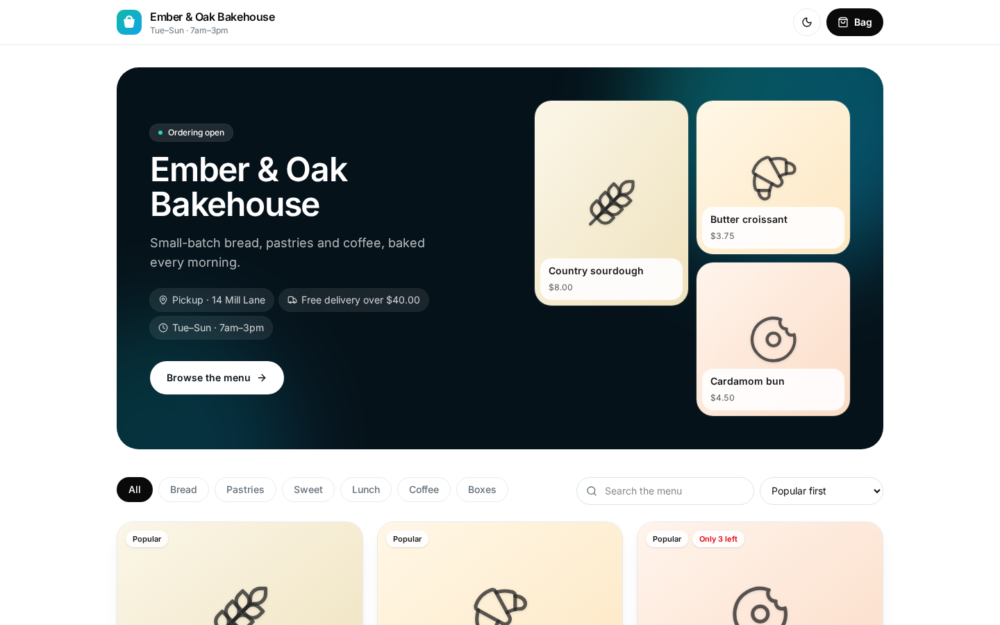

## Features

**Storefront**
- Hero with the shop name, tagline, pickup address, delivery terms and opening hours
- Featured products shown as a mosaic, plus "Popular" and "Only 3 left" badges on cards
- Category chips, search across names and descriptions, and sorting by popularity, price or name. Sold-out items always sit at the end.
- Quick view with quantity picker that respects stock already in the bag
- Light and dark themes, and a sticky "View bag" bar on phones

**Bag and checkout**
- Quantity steppers capped at available stock
- Pickup or delivery, with a progress bar toward free delivery
- Promo codes checked against the shop's active codes
- Checkout form with validation: name, phone, delivery address only when needed, and an optional note
- Placing an order reserves stock, then builds a ready-to-send WhatsApp message with a copy fallback

**Orders (owner)**
- Today's sales, open orders, average order value and sales to date. Cancelled orders are never counted.
- Open / Completed / Cancelled / All tabs with counts
- One-tap status flow from New to Confirmed, Ready and Completed, with undo
- "Message customer" opens WhatsApp with an update that fits the next step, for example "ready for pickup at…" or "heading your way"
- Cancelling an order returns its stock
- Best sellers by units

**Products (owner)**
- Add, edit and delete products, with a confirmation before deleting
- Upload a photo, which is scaled down in the browser, or pick an illustrated tile
- Track stock or mark an item as always available. Stock steppers sit inline in the table.
- Low-stock and sold-out banner

**Settings (owner)**
- Shop name, tagline, WhatsApp number, currency and opening hours
- Turn pickup and delivery on or off, plus the pickup address, delivery fee and free-delivery threshold
- Create, switch on or off, and delete promo codes
- Reset the demo data

## Screenshots

| Menu with items in the bag | Bag with delivery and promo |
| --- | --- |
| 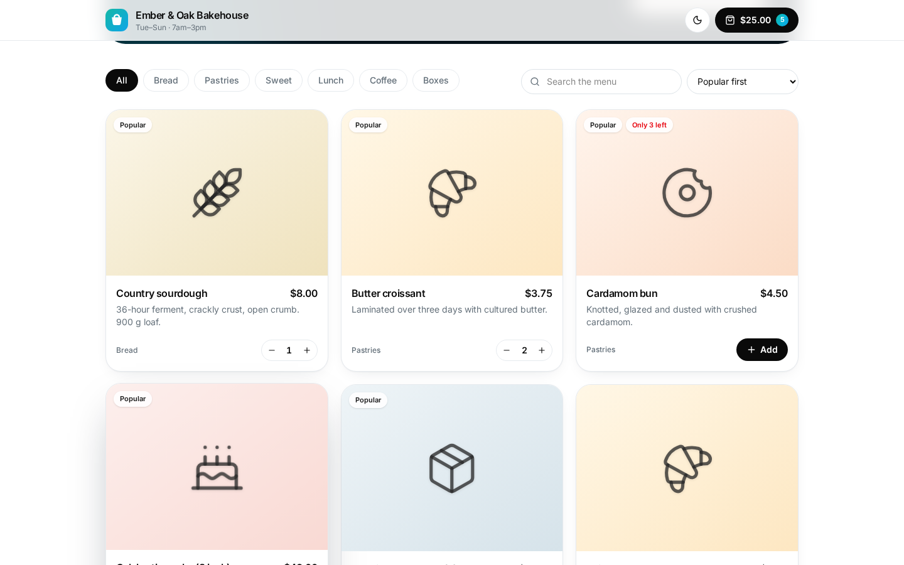 | 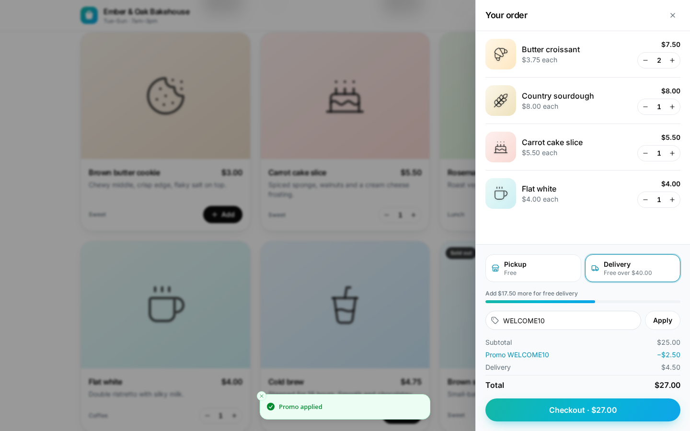 |
| **Order ready for WhatsApp** | **Quick view** |
| 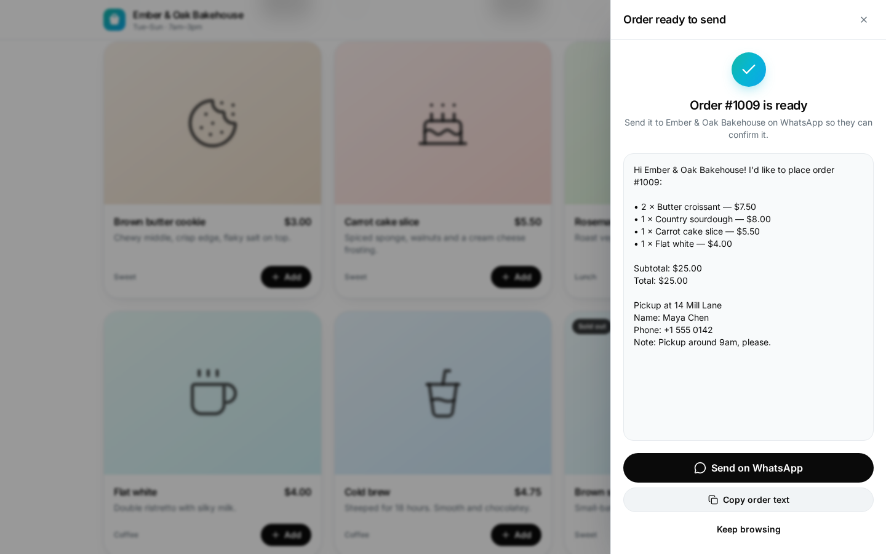 | 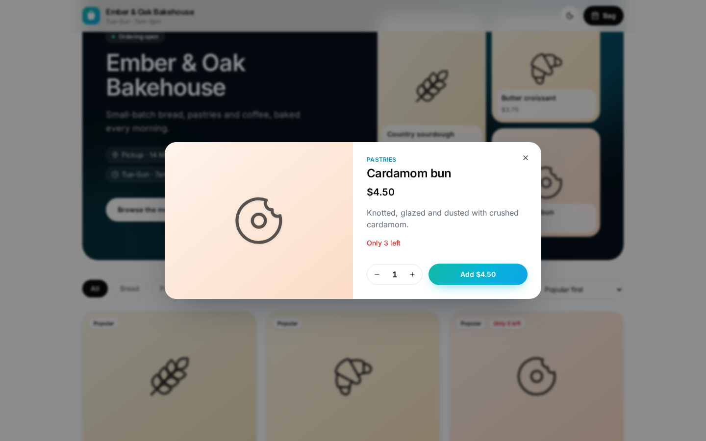 |
| **Orders** | **Products** |
| 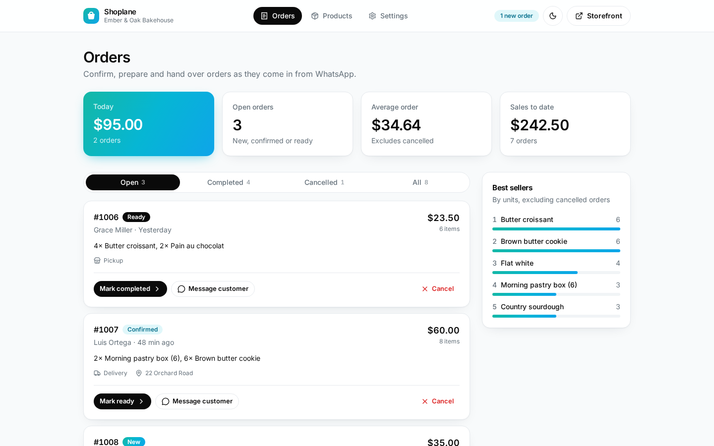 | 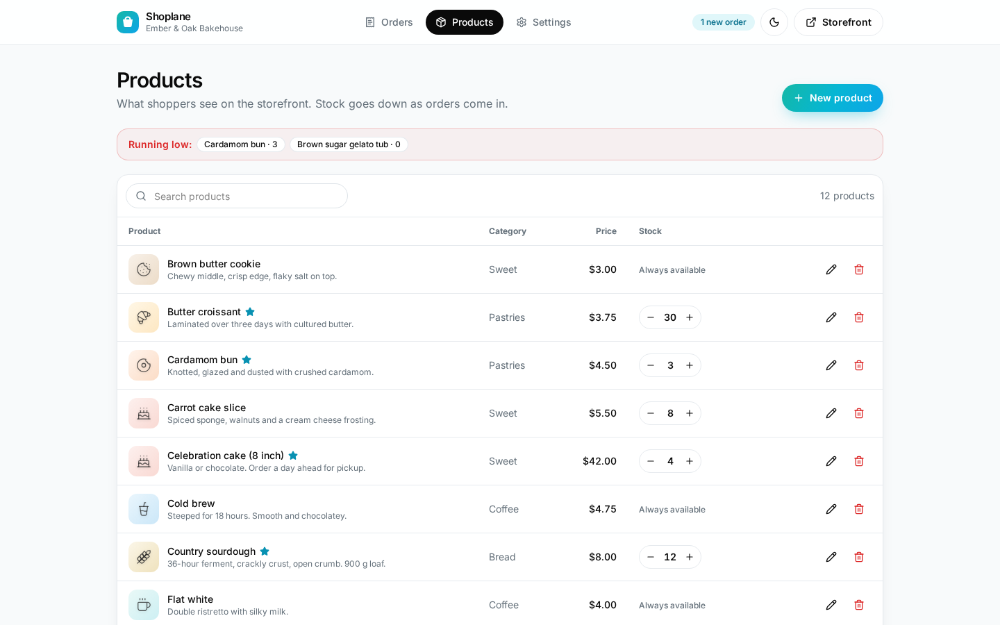 |
| **Edit product** | **Settings** |
| 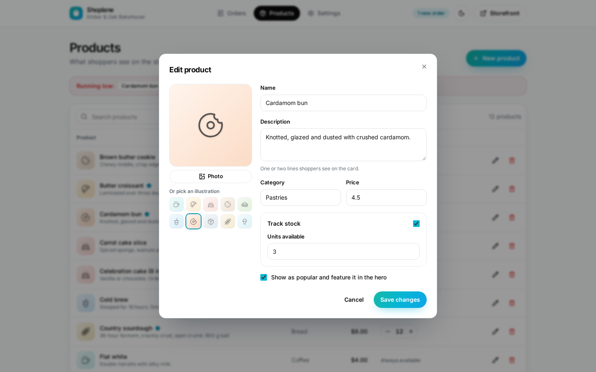 | 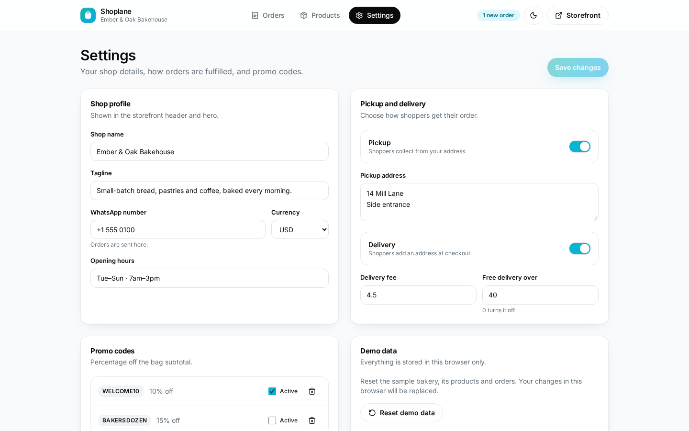 |
| **Storefront, dark** | **Orders, dark** |
| 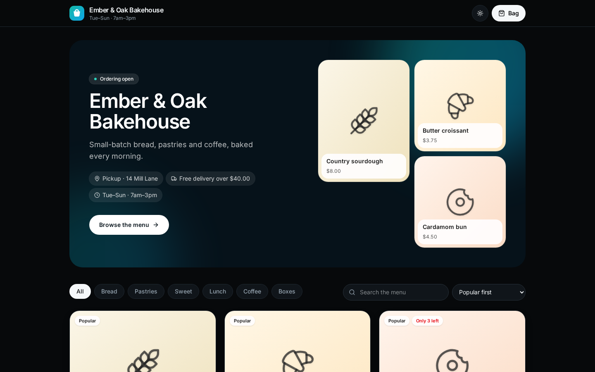 | 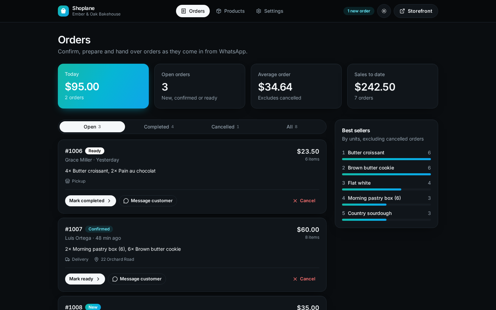 |

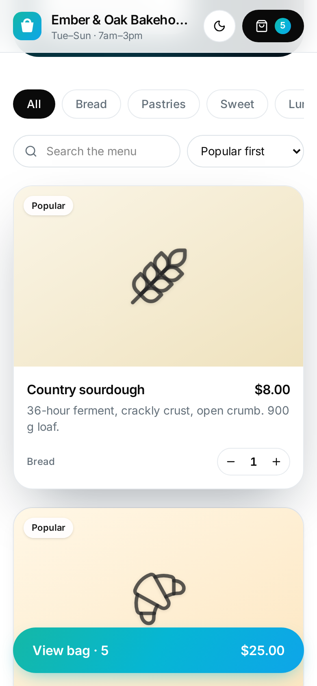

## Design

- **Palette:** an ocean gradient (teal #14B8A6 → cyan #06B6D4 → sky #0EA5E9) on white, with black ink for primary actions and a deep navy hero. Dark mode uses near-black with the same gradient.
- **Type:** Inter (variable, self-hosted)
- **Details:** rounded-3xl cards, pill buttons, soft glow on gradient actions, and illustrated product tiles, so a shop looks good before it has photos

## Tech stack

- React 19 and TypeScript, built with Vite
- Tailwind CSS v4
- Zustand with `persist` for local-first storage
- wouter for hash routing, Radix Dialog for the drawer and dialogs, zod for validation, sonner for toasts
- Vitest and Testing Library, including full checkout and owner flows
- GitHub Actions for lint, tests and build

## Project structure

```
src/
  lib/          cart pricing, promo codes, catalog filters, order messages, stats, validation (unit tested)
  store/        persisted store and the fictional sample bakery
  pages/        Storefront, manager Orders, Products, Settings, 404
  components/   product cards, quick view, bag drawer, manager shell, UI primitives
  test/         end-to-end style component tests
```

## Run locally

Requirements: Node.js 20 or newer and pnpm (`corepack enable` or `npm install -g pnpm`).

```bash
git clone https://github.com/gabrielolarinre74-pixel/shoplane.git
cd shoplane
pnpm install
pnpm dev
```

Open http://localhost:5173 for the storefront, or http://localhost:5173/#/manage for the owner view.

### Demo mode

Shoplane starts with a fictional bakery. It has twelve products, two promo codes (`WELCOME10` is active) and a handful of orders dated relative to today. The WhatsApp number is a placeholder, so "Send on WhatsApp" opens a chat to a number that doesn't exist. Set your own number in **Settings** to try it for real. Everything is saved in your browser's `localStorage` and never leaves your device. Use **Settings → Reset demo data** to start over.

### Other commands

```bash
pnpm test
pnpm lint
pnpm build     # static site in dist/
pnpm preview
```

No API keys are needed. `.env.example` lists the one optional build setting.

## Roadmap

- Shared catalog backend so several devices see the same orders
- Payment links at checkout
- Printable order tickets for the kitchen

## License

MIT. See [LICENSE](LICENSE).

---

Designed and developed by **Gabriel Zion** · [Gabriel.ATH](https://gabrielzion-portfolio.vercel.app). Websites, apps, automation and UI/UX for growing businesses.
